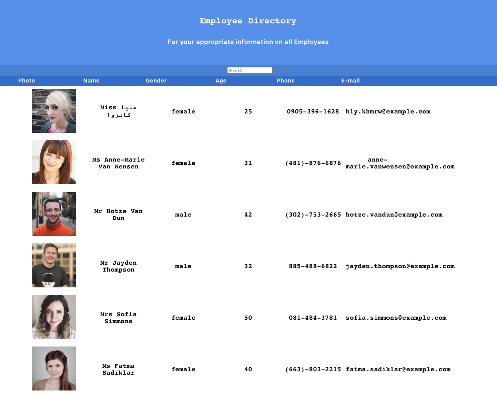

# Employee Directory

## Description

Employee directory is a react app that lets users view a list of random generated users from [Random User Generator](https://randomuser.me/) 
and sort them by first name, last name, age, etc.

Whenever a user clicks the category button (name, age) at the top of each table column, the listed users will be displayed in ascending order by that category.

The app also has  a search bar that allows you to search through the list by names.

## Table of Contents
* [Description](#description)
* [Installation](#installation)
* [License](#license)
* [Contact](#contact)

## Installation

The application is deployed [here](https://michaelmw17.github.io/react-employee-directory/), Can download the repository and perform an 'npm install' command and invoke the application with 'npm start'. The server will connect to 'localhost:3000'.

*Steps required to install project and how to get the development environment running:*
## License

## Deployed Application

[Click here](https://michaelmw17.github.io/react-employee-directory/) to visit the deployed application.

*Images of the deployed application:*

 
## Contact

_Michael Watt_

- [Github!](https://github.com/Michaelmw17)
- [LinkedIn!](https://www.linkedin.com/in/michael-watt-6a76961b3/)
- [Portfolio!](http://michaelmw17.github.io/)
- Email:(michaelmw17@outlook.com)
